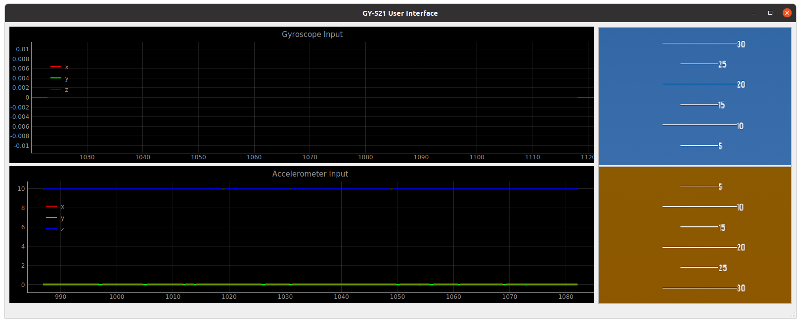
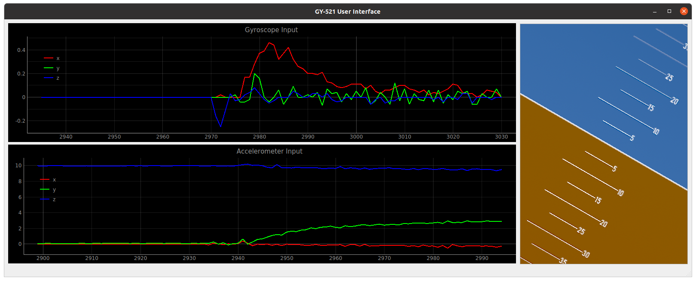

# GUI and Artificial Horizon for GY-521 (MPU 6050) Gyroscope + Accelerometer 

A gui made using pyqt5 and pyqtgraph that presents the input from GY521 module in graphs. The artificial horizon uses the data from the accelerometer. The garphs are built using pyqtgraph.

